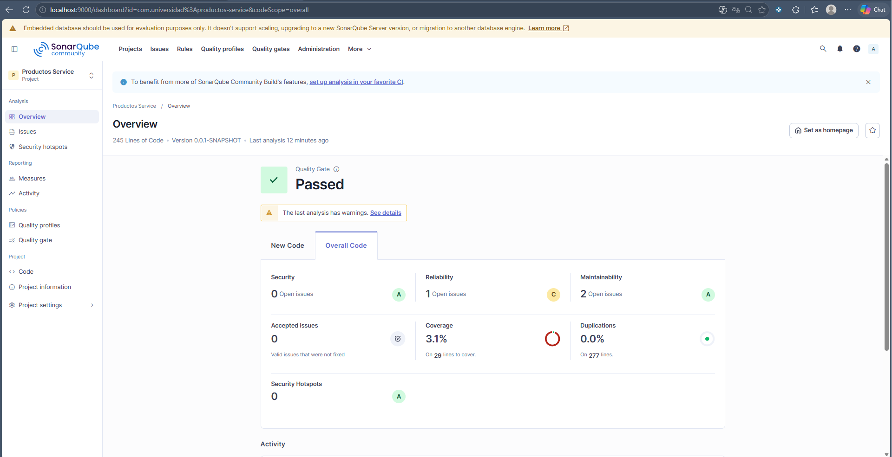
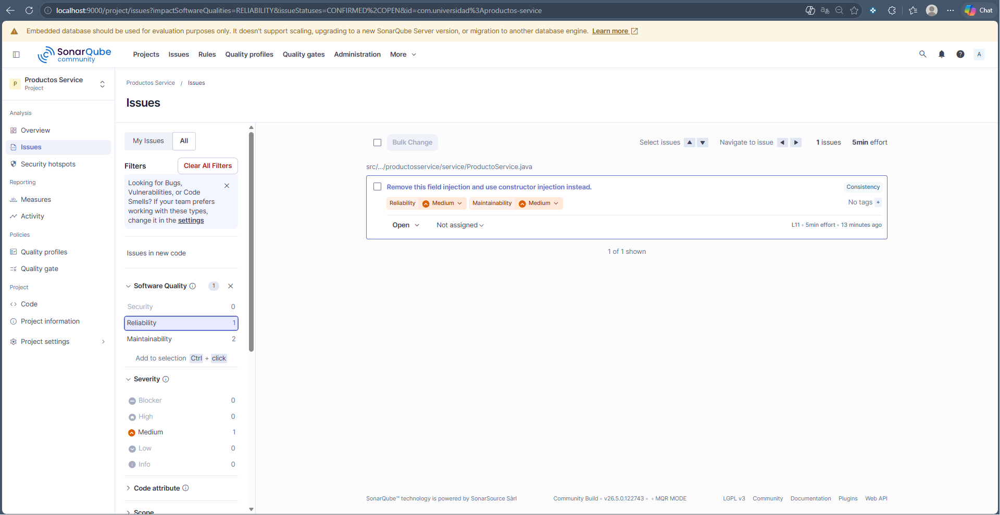
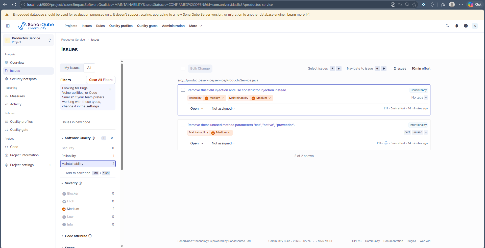
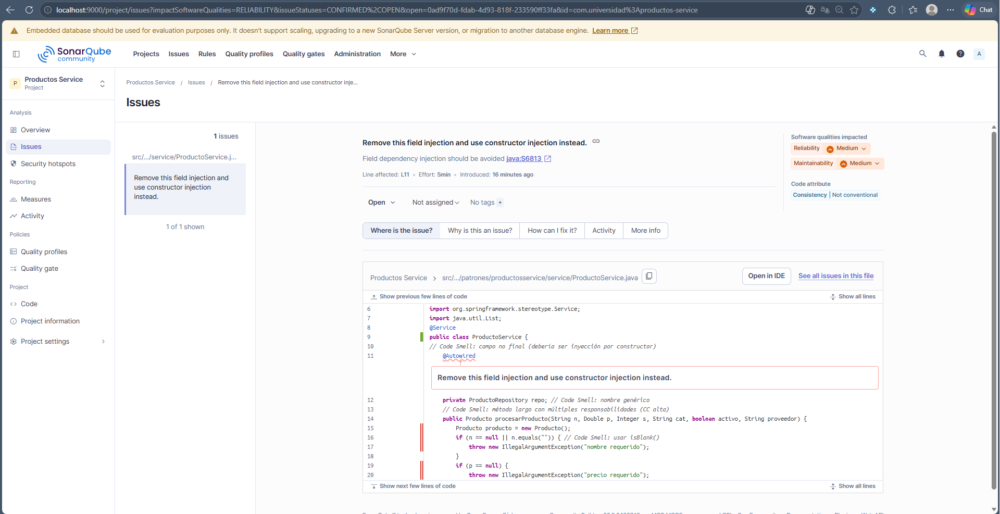
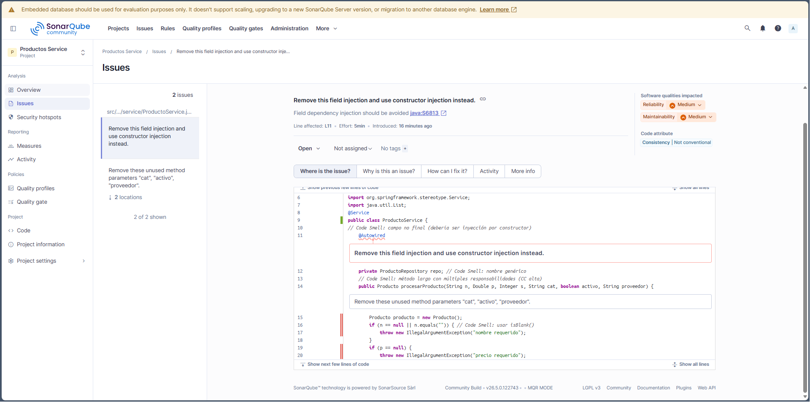
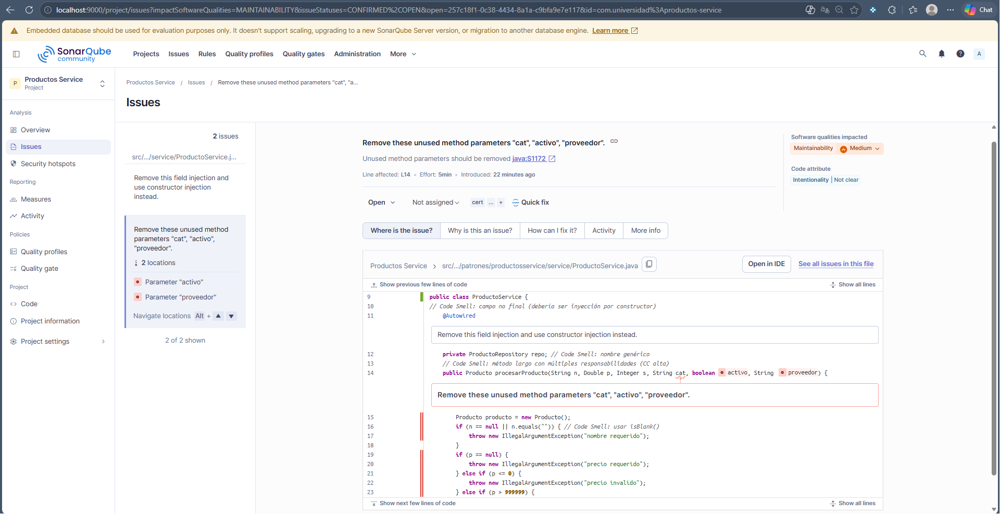

# Productos Service — Análisis SonarQube

## Estado inicial del análisis

| Categoría | Cantidad | Rating |
|-----------|----------|--------|
| Bugs | 0 | ✅ A |
| Vulnerabilidades | 0 | ✅ A |
| Code Smells | 0 | ⚠️ A |
| Reliability Issues | 1 | ⚠️ Medium |
| Maintainability Issues | 2 | ⚠️ Medium |
| Cobertura | 3.1% | 📊 — |
| Duplications | 0.0% | ✅ Clean |

**Líneas de código:** 245  
**Versión:** 0.0.1-SNAPSHOT  
**Quality Gate:** ✅ Passed  
**Última análisis:** 3 minutos atrás

---

## Hallazgos principales identificados

### Issue 1: Inyección de campo (Field Injection) - Arquivo: `ProductoService.java`, línea **L11**
**Severidad:** ⚠️ Medium  
**Categoría:** Reliability  
**Descripción:** 
Se detectó el uso de inyección de campo (field injection) mediante anotación `@Autowired` en un campo privado. Esto no es una práctica recomendada según los estándares de Spring Framework y SonarQube.

**Recomendación:**
```java
// ❌ Incorrecto - Field Injection
@Autowired
private ProductoRepository repo;

// ✅ Correcto - Constructor Injection
private final ProductoRepository repo;

public ProductoService(ProductoRepository repo) {
    this.repo = repo;
}
```

**Beneficios de la corrección:**
- Mayor testabilidad
- Mejor inyección de dependencias explícita
- Mejor seguimiento de dependencias

---

### Issue 2: Parámetros de método no utilizados - Archivo: `ProductoService.java`, línea **L14**
**Severidad:** ⚠️ Medium  
**Categoría:** Maintainability  
**Descripción:** 
El método `procesarProducto()` contiene parámetros sin usar: `"cat"`, `"activo"`, `"proveedor"`. Estos parámetros no son utilizados dentro del cuerpo del método.

**Parámetros problemáticos:**
- `cat` (boolean)
- `activo` (boolean)  
- `proveedor` (String)

**Recomendación:**
Evaluar si estos parámetros son necesarios. Si no se utilizan, removerlos de la firma del método para mantener la interfaz limpia y evitar confusión.

```java
// ❌ Antes - Con parámetros no utilizados
public Producto procesarProducto(String n, Double p, Integer s, 
                                  String cat, boolean activo, String proveedor) {
    Producto producto = new Producto();
    // Código que SOLO usa: n, p, s
    // ... resto del código
}

// ✅ Después - Parámetros limpios
public Producto procesarProducto(String n, Double p, Integer s) {
    Producto producto = new Producto();
    // Código limpio sin parámetros no utilizados
    // ... resto del código
}
```

---

## Métricas de Cobertura

- **Líneas para cubrir:** 29
- **Líneas cubiertas:** ~8 (3.1%)
- **Líneas duplicadas:** 277
- **Porcentaje de duplicación:** 0.0%

---

## Recomendaciones de mejora

1. **Aumentar la cobertura de pruebas unitarias**
   - Objetivo: Alcanzar al menos 80% de cobertura
   - Enfocar en las clases principales: `ProductoService` y `Producto`

2. **Refactorizar la inyección de dependencias**
   - Cambiar de field injection a constructor injection
   - Proporciona mejor transparencia en las dependencias

3. **Limpiar la interfaz de métodos**
   - Remover parámetros no utilizados
   - Mantener métodos enfocados y simples

4. **Implementar pruebas de integración**
   - Validar la interacción con el repositorio
   - Asegurar comportamiento esperado en escenarios reales

---

## Capturas del Dashboard

Las capturas de pantalla del análisis de SonarQube están disponibles en la carpeta `docs/`:

### Dashboard Principal
  
*Vista general del proyecto mostrando Quality Gate, bugs, vulnerabilidades y cobertura*

### Detalle de Issues
  

*Listado detallado de los issues identificados en el código*

### Reporte de Cobertura

---

---
 
---
*Análisis de cobertura por archivo*

> **Nota:** Para ver las imágenes completas, consulta la carpeta [`docs/`](./docs/) o accede directamente a SonarQube en http://localhost:9000

---

## Configuración de SonarQube

- **URL de SonarQube:** http://localhost:9000
- **Proyecto:** com.universidad:productos-service
- **Key del proyecto:** com.universidad%3Aproductos-service
- **Versión de análisis:** 0.0.1-SNAPSHOT

---

## Próximos pasos

1. ✅ Revisar y corregir los issues identificados
2. ✅ Aumentar la cobertura de pruebas
3. ✅ Re-ejecutar el análisis de SonarQube
4. ✅ Monitorear métricas en el tiempo

---

## Referencias

- **SonarQube Rules:** https://rules.sonarsource.com/
- **Spring Framework Best Practices:** https://spring.io/projects/spring-framework
- **Java Code Quality:** https://www.sonarqube.org/

---

**Generado:** 2026-05-13  
**Proyecto:** Productos Service  
**Equipo:** Desarrollo - Universidad


